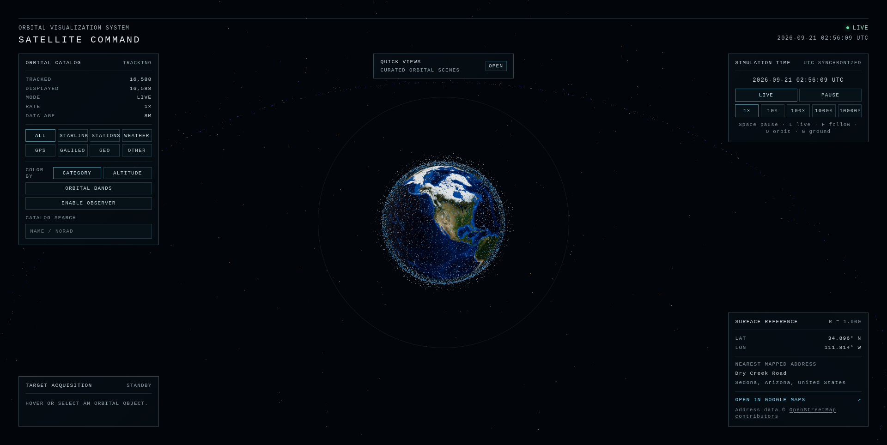

# Satellite Command

Explore thousands of real satellites from a mission-control view of Earth, all in your browser.

[Launch Satellite Command](https://d-holguin.github.io/satellite-command/)

Rotate the globe, search for a spacecraft, isolate constellations like Starlink or GPS, speed up time, and see which satellites are above your location.

The orbital catalog comes from [CelesTrak](https://celestrak.org/) and refreshes every six hours. Satellite positions are calculated live on your device.

Built with Angular, Three.js, and satellite.js.
